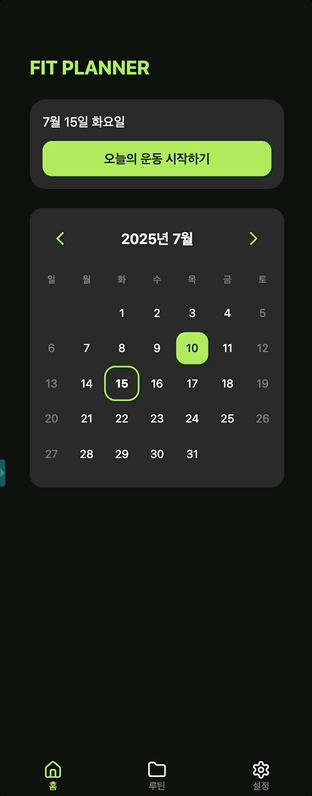
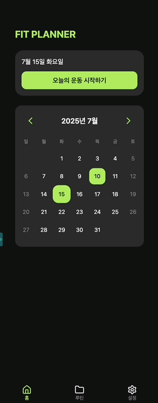
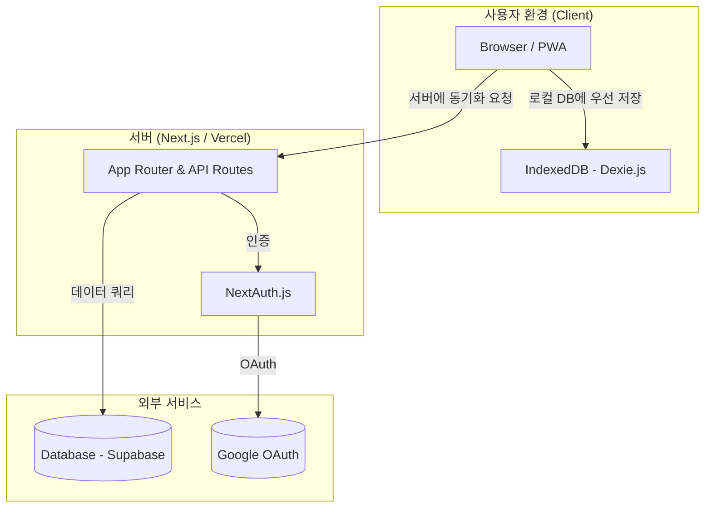
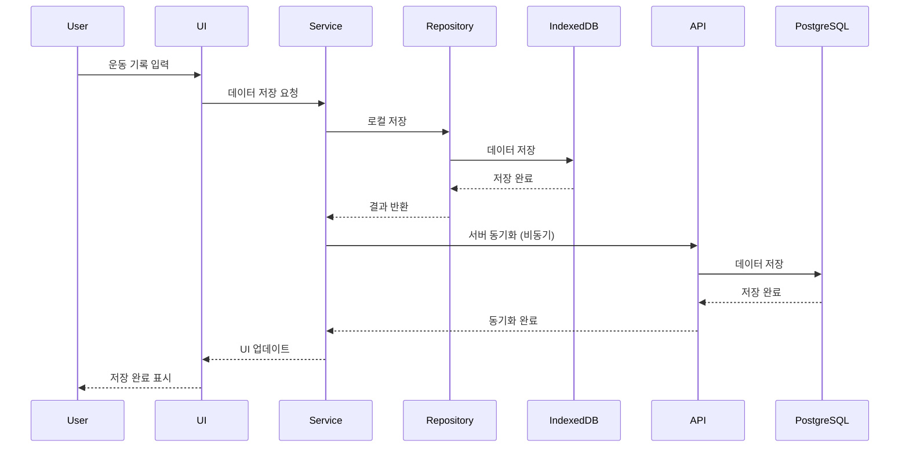
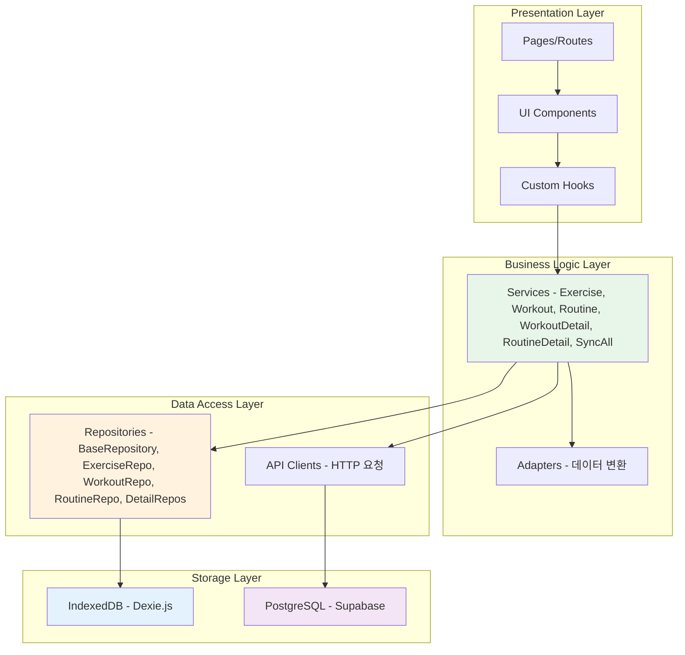

# Fit Planner

운동 루틴 관리와 기록을 위한 Progressive Web App

## 주요 기능

- **운동 루틴 관리**: 나만의 운동 루틴 생성 및 관리
- **운동 기록**: 세트별 무게, 횟수, 휴식 시간 기록
- **PWA**: 모바일 앱처럼 설치 가능

### 🎬 기능 시연

<details>
<summary>운동 세션 추가</summary>



</details>

<details>
<summary>이전 운동 기록 불러오기</summary>



</details>

<details>
<summary>루틴 관리</summary>


</details>

## 💡 주요 기술 결정 및 트러블슈팅

- **오프라인 지원을 위한 아키텍처 설계**: (문제/해결 요약)
- **서비스 계층 리팩토링**: (문제/해결 요약)
- **(기타 1~2가지)**

## 🏛️ 아키텍처

<details>
<summary>전체 시스템 아키텍처</summary>



</details>

<details>
<summary>데이터 흐름 다이어그램</summary>



</details>

<details>
<summary>계층 구조 다이어그램</summary>



</details>

## 🛠️ 기술 스택

### 주요 기술 (Core)

- **Framework**: Next.js (App Router), React
- **Language**: TypeScript
- **Styling**: Tailwind CSS
- **ORM & Database**: Prisma, Supabase (PostgreSQL)
- **Authentication**: NextAuth.js (Google OAuth)

### 상태 관리 및 데이터 처리

- **Client-Side State**: Zustand, Context API
- **Local Database**: Dexie.js (IndexedDB)
- **Data Validation**: Zod

### 테스트 및 품질 관리

- **Testing Framework**: Jest, React Testing Library
- **API Mocking**: MSW (Mock Service Worker)

### PWA & 배포

- **PWA**: Next-PWA
- **Deployment**: Vercel

## 로컬 개발

```bash
# 의존성 설치
yarn install

# Prisma 클라이언트 생성
yarn prisma:generate

# 개발 서버 실행
yarn dev
```

## 환경 변수

`.env` 파일에 다음 변수들이 필요합니다:

```
DATABASE_URL=
NEXTAUTH_URL=
NEXTAUTH_SECRET=
GOOGLE_CLIENT_ID=
GOOGLE_CLIENT_SECRET=
```

## 배포

Vercel에 자동 배포되도록 설정되어 있습니다.

## 라이선스

MIT
